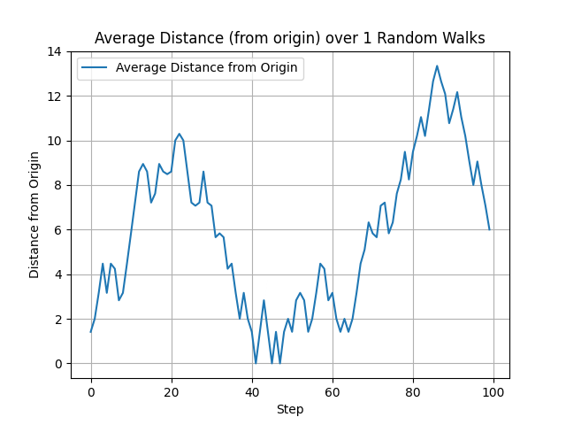
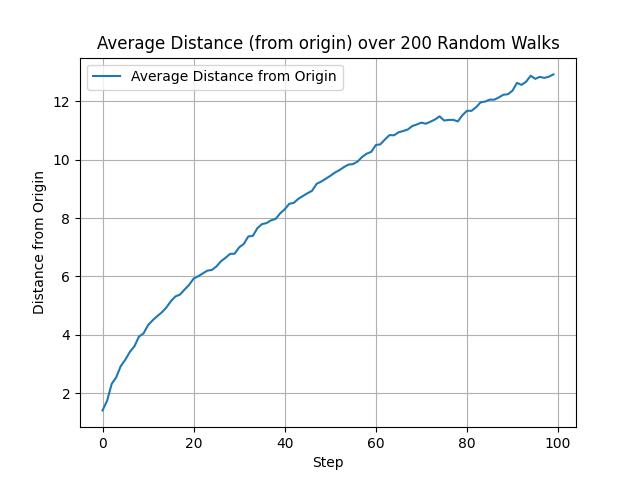

# Quantum-Experiments
Experiments with quantum algorithms and circuits..

What does ```random_walk.py``` do?

Essentially, it aims to solve the problem of random number generation. 
We take a random walk problem of an atom moving inside a 2D lattice, which has 4 possible steps to "jump" to, inside the lattice. The quantum circuit uses 2 qubits, and applies a Hadamard gate on them, to create an equal probability of both to be either 0 or 1. After that, the outputs determine the final random step.

Since, it is a random walk, over a single sample, the average distance travlled would appear to be random (see fig. 1). 


But, over a large number of samples, the average distance travelled across all samples, appears to be a function proportional to sqrt(n) (see fig. 2)


Note: Added multi-core support. Please change the value of ```max_workers=x``` according to your CPU's core count.


QCNN: MNIST classification using hybrid models (refer to QCNN/readme.md for more info)